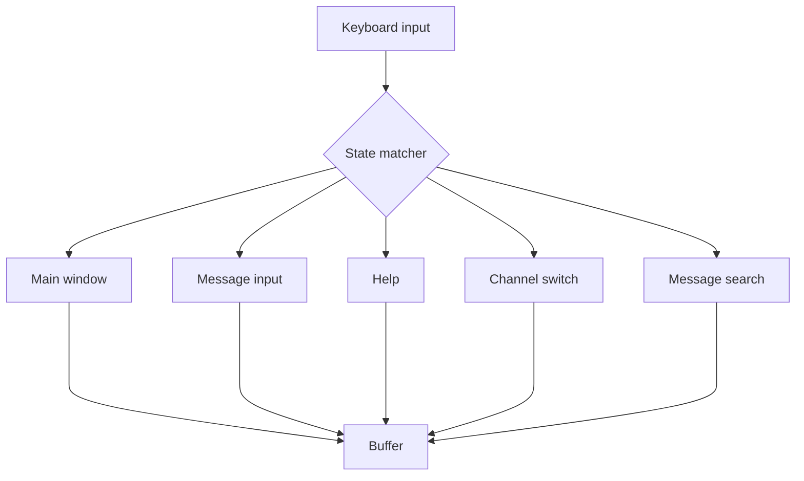
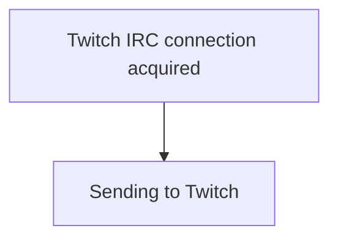

# Communication between threads

## Keyboard inputs

```mermaid
graph TD;
    A[Keyboard input] --> B{State matcher};
    B --> C[Main window];
    B --> D[Message input];
    B --> E[Help];
    B --> F[Channel switch];
    B --> G[Message search];
    C ----> H[Buffer];
    D ----> H[Buffer];
    E ----> H[Buffer];
    F ----> H[Buffer];
    G ----> H[Buffer];
```

## Twitch chat messages

```mermaid
graph TD;
    A[Twitch IRC connection acquired] --> B[Sending to Twitch];
```
