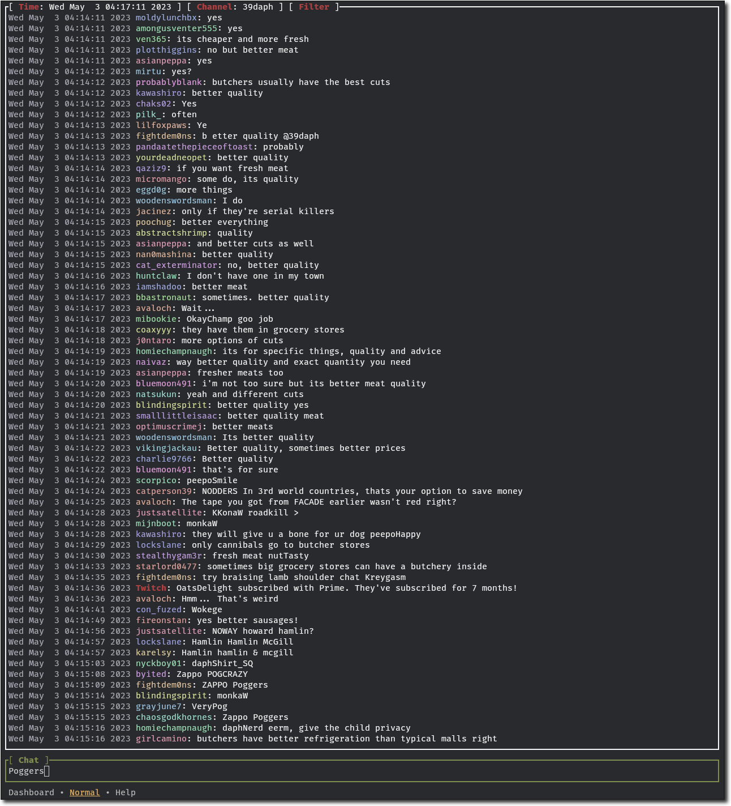

# twitch-tui

Twitch chat in the terminal.

[![crates][s1]][l1] [![CI][s2]][l2] [![pre-commit.ci status][s3]][l3] [![lines of code][s4]][l4] [![unsafe][s5]][l5]

[s1]: https://img.shields.io/crates/v/twitch-tui.svg
[l1]: https://crates.io/crates/twitch-tui
[s2]: https://github.com/Xithrius/twitch-tui/actions/workflows/ci.yml/badge.svg
[l2]: https://github.com/Xithrius/twitch-tui/actions/workflows/ci.yml
[s3]: https://results.pre-commit.ci/badge/github/Xithrius/twitch-tui/main.svg
[l3]: https://results.pre-commit.ci/latest/github/Xithrius/twitch-tui/main
[s4]: https://tokei.rs/b1/github/Xithrius/twitch-tui?category=code
[l4]: https://github.com/Xithrius/twitch-tui
[s5]: https://img.shields.io/badge/unsafe-forbidden-success.svg
[l5]: https://github.com/rust-secure-code/safety-dance/

## Feature list

- Read/send/search messages
- Switch channels
- Create and toggle filters
- Command, channel, and mention suggestions
- Customize functionality and looks to your liking using a [config file](https://github.com/Xithrius/twitch-tui/blob/main/default-config.toml)

## Links

- [Documentation](https://xithrius.github.io/twitch-tui/)
- [Setup](https://xithrius.github.io/twitch-tui/guide/installation)

## More information

If you have any problems, do not hesitate to [submit an issue](https://github.com/Xithrius/twitch-tui/issues/new/choose).

Combine this application with [streamlink](https://github.com/streamlink/streamlink) to rid the need of a browser while watching streams.

This project follows the guidelines of [Semantic Versioning](https://semver.org/).
