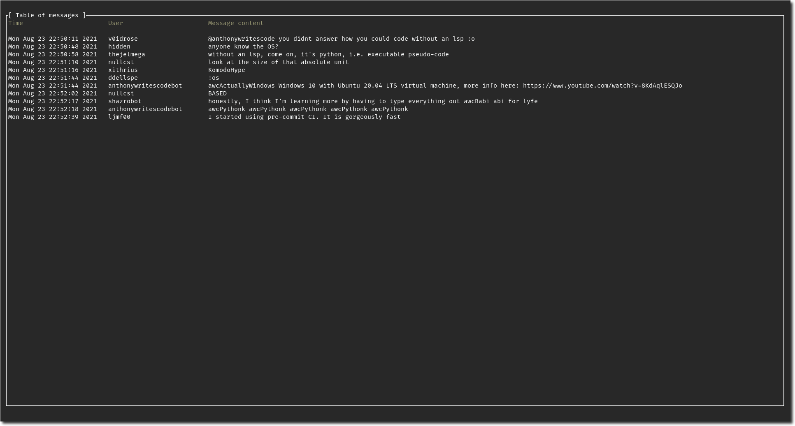

# Twitch chat in the terminal

### What it looks like

### Keybinds

  
Normal mode

  <table>
  <tr>
    <td> <b>Key</b>
    <td> <b> Description</b>
  <tr>
    <td> c
    <td> Go to the chat window chat.
  <tr>
    <td> i
    <td> Enter message input mode for sending messages. Exit this mode with `Esc`.
  <tr>
    <td> ?
    <td> Have the keybinds popup window appear.
  <tr>
    <td> q
    <td> Quit out of the entire application once in the base chat view.
  <tr>
    <td> s
    <td> Open a popup window to switch channels.
  <tr>
    <td> Ctrl + f
    <td> Enter message search mode, which highlights messages in the main window which match the query.
  <tr>
    <td> Esc
    <td> Exits out of layered windows, such as going from the help window to normal view.
  </table>

  
Input mode (message sending/searching, channel swapping)

  <table>
  <tr>
    <td> <b>Key</b>
    <td> <b> Description</b>
  <tr>
    <td> Ctrl + w
    <td> Cuts a single word (from the cursor to the next whitespace).
  <tr>
    <td> Ctrl + u
    <td> Cuts the entire line.
  <tr>
    <td> Ctrl + f
    <td> Move cursor to the right.
  <tr>
    <td> Ctrl + b
    <td> Move cursor to the left.
  <tr>
    <td> Ctrl + a
    <td> Move cursor to the start.
  <tr>
    <td> Ctrl + e
    <td> Move cursor to the end.
  <tr>
    <td> Alt + f
    <td> Move to the end of the next word.
  <tr>
    <td> Alt + b
    <td> Move to the start of the previous word.
  <tr>
    <td> Ctrl + t
    <td> Swap previous character with current character.
  <tr>
    <td> Alt + t
    <td> Swap previous word with current word.
  <tr>
    <td> Ctrl + u
    <td> Remove everything before the cursor.
  <tr>
    <td> Ctrl + k
    <td> Remove everything after the cursor.
  <tr>
    <td> Ctrl + w
    <td> Remove the previous word.
  <tr>
    <td> Ctrl + d
    <td> Remove character to the right.
  <tr>
    <td> Enter
    <td> Confirm the current text to go through (doesn't do anything in message search mode).
  </table>

### Setup

1. Make sure you have Cargo installed from [rust-lang website](https://www.rust-lang.org/learn/get-started). Make sure the Cargo binary folder is appended to your `$PATH` environment variable if you get errors when attempting to install the binary with Cargo.
Copy [`default-config.toml`](https://github.com/Xithrius/twitch-tui/blob/main/default-config.toml) to a `config.toml` file. Based on your OS, place the config file in the directories listed below. Any command line options/arguments taken from `twt --help` (when the binary is eventually installed) will overwrite the corresponding value in the config file.
   - Windows: `%appdata%\twt\config.toml`
   - Linux/MacOs: `~/.config/twt/config.toml`
3. Get an OAuth token from [Twitch](https://twitchapps.com/tmi/), and place the value in the `token` variable in the `config.toml` file that you created.
4. Run `cargo install twitch-tui` to install the binary. Run the same command in the future to acquire updates.
5. Running `twt` in the terminal will launch the application. For CLI options/arguments, run `twt --help`.

If you have any problems, do not hesitate to [submit an issue](https://github.com/Xithrius/twitch-tui/issues/new/choose).
      
### More information

- This project used to be named `terminal-twitch-chat`, but was renamed to `twitch-tui` in version [1.2.2](https://github.com/Xithrius/twitch-tui/releases/tag/v1.2.2).
